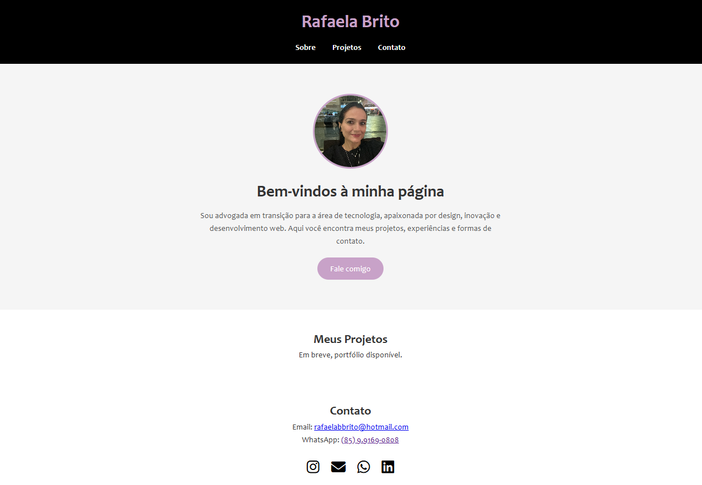

# 🌐 Landing Page - Rafaela Brito

Este projeto é uma **landing page pessoal** desenvolvida com **HTML, CSS e JavaScript**, com layout **clean e responsivo**, utilizando uma paleta de cores branca, preta, cinza e lilás, além da fonte *Candara*.

## 🎯 Objetivo
Apresentar de forma simples e elegante minhas informações profissionais, portfólio e canais de contato.

## ✨ Funcionalidades
- Layout responsivo para dispositivos móveis e desktops.
- Foto de perfil circular com borda personalizada.
- Links rápidos para:
  - Instagram
  - E-mail
  - WhatsApp
  - LinkedIn
- Botão de rolagem suave para a seção de contato.

## 🖼️ Prévia
  
*(Adicione um print da página e salve como `screenshot.png` na pasta do projeto.)*

## 🚀 Tecnologias Utilizadas
- **HTML5** - Estrutura do site.
- **CSS3** - Estilização e responsividade.
- **JavaScript** - Rolagem suave para seções.
- **Font Awesome** - Ícones das redes sociais.

## 📂 Estrutura de Pastas
📁 minha-landing-page
┣ 📜 index.html
┣ 📜 style.css
┣ 📜 script.js
┣ 📜 foto-perfil.jpg
┗ 📜 README.md
